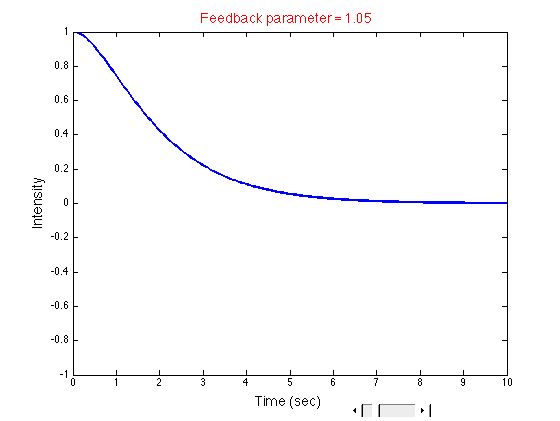
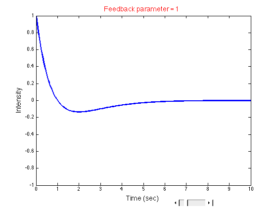

# An-introduction-to-Matlab-for-Life-Scientists

The aim of this course is to familiarize life scientists with the common programming environment of Matlab. No background in programming is required. The participants will run many (pre-developed) programs relevant to biological data sets (
<a href="../../blob/master/Exercise-4/ex4_11.m" target="_blank">fluorescence microscopy</a>, 
<a href="../../blob/master/Exercise-2/ex2_12.m" target="_blank">mass spectrometry</a>, 
<a href="../../blob/master/Exercise-3/ex3_6.m" target="_blank">x-ray crystallography</a>, 
<a href="../../blob/master/Exercise-6/ex6_8.m" target="_blank">single-particle electron microscopy</a>, 
<a href="../../blob/master/Exercise-7/ex7_9.m" target="_blank">kinetics</a> 
...). 
  
The programs start from simple and small ones and evolve gently towards more elaborate and applied ones. Programming concepts and tools are learnt implicitly, as the participants observe minor changes from one program to the next.

</img>
 
</img>

